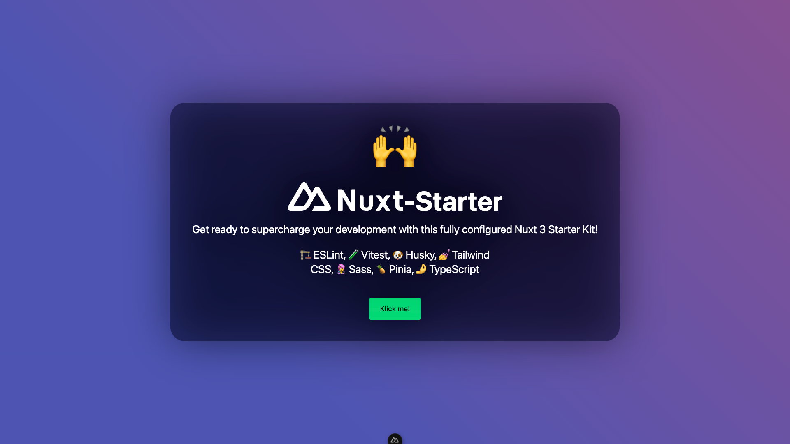

# Nuxt 3 Starter 

Get ready to supercharge your development with this fully configured Nuxt 3 Starter Kit! Built on Vue 3 and powered by TypeScript, this setup comes preloaded with tools and libraries designed to enhance your workflow, streamline development, and maintain high-quality code. No more wrestling with configurations—jump straight into building amazing projects! 🙌

--

## 🚀 Getting Started
1. Clone or download this repository
2. Ensure you have Node version v22.13.0 up an running
3. Make sure you have yarn version 4.6.0. (running `corepack enable` should do the trick - using the package manager of your choice should also work 😉).
4. Run `yarn` or `yarn install` to install dependencies
5. Run `yarn dev` to start the local development environment

### 🧹 Optional Auto-Clean Setup
Nuxt-Starter is delivered with a range of example content – including sample components, tests, and store configurations. If you'd prefer to start with a clean setup, simply run the following CLI command in your terminal `yarn start-clean` - this command offers an easy, one-step process to prepare your Nuxt 3 project for a fresh start.
- It empties the contents of './components', './tests' and ./store while keeping the directories intact.
- It completely deletes the './.assets/img', './coverage', './.github', './.vscode', './.git' folder, and all its contents. 🚨 Since the .git folder will be deleted your project will be disconnected from this repository.
- The cleaning script is set up to delete itself after execution, ensuring that your project is as lean as possible once you’ve cleaned up the examples - therefor it will delete the script file as well as the npm script 'start-clean' from the package.json file.
- It wil delete the node_modules, .nuxt and .output folders, empty the yarn-cache and reinstall everything from scratch.

--

## 🚀 What's Inside?
This starter kit is packed with carefully chosen dependencies to handle real-world scenarios. Here’s why they’re included:

### ⚡️ Vite
Why? Because it’s blazing fast. Vite ensures instant builds and on-demand compilation, making both development and production smoother and quicker.
[learn more](https://vitejs.dev/).

### 🏗️ ESLint
ESLint V9 with a "Flat Config setup" tailored for TypeScript and Vue 3 or Nuxt 3 - it is configured to use best practices integrating some plugins (eslint:recommended, typescript-eslint, and eslint-plugin-vue) - wanna change them!? just add some custom rules to meet your team's needs to ensure clean, maintainable, and standard-compliant code quality.
[learn more](https://eslint.org/blog/2024/04/eslint-v9.0.0-released/).

### 🧪 Vitest
To test smarter and faster. Vitest is a lightweight, Jest-compatible testing framework that ensures code reliability and helps you catching bugs early. 
[learn more](https://vitest.dev/).

### 🐶 Husky
Husky enforces pre-push hooks, ensuring quality checks are performed before code is pushed to the repository. The pre-push hook runs automated tasks like linting & tests preventing errors in the main branch. This workflow helps catch issues early, ensuring a clean and stable codebase.
[learn more](https://typicode.github.io/husky/).

### 💅 Tailwind CSS
Tailwind CSS is a highly effective utility-first CSS framework that greatly enhances the styling of a Nuxt project. Tailwind's zero-runtime feature further adds to its performance, making it a valuable addition to a Nuxt project looking to achieve high-quality and optimized styling.
[learn more](https://tailwindcss.com).

### 👩‍🎤 Sass
For flexibility in styling. Use SCSS to add custom styles when needed - SCSS definitions should not use @apply (more information can be found within the [tailwind documentation](https://tailwindcss.com/docs/compatibility#sass-less-and-stylus)). However using SCSS alongside Tailwind can be an option for stuff like animations or other things that are not solvable convenient using Tailwind (or of course instead of tailwind if this is what you prefer).
[learn more](https://sass-lang.com/).

### 🍍 Pinia
To manage app state easily. Pinia is modern, simple, and works perfectly with Vue 3 and Nuxt 3, for scalable state management.
[learn more](https://pinia.vuejs.org).

### 🤌 TypeScript
TypeScript enhances the JavaScript language by adding optional static typing and other features, for safer, smarter code - helping avoiding errors and catching bugs early in development.
[learn more](https://www.typescriptlang.org/).

<!-- ### Storybook
Storybook streamlines the UI development process by allowing for isolated development of individual components. It provides better visualization and collaboration, making it easier for teams to work together and create a better end product.
[learn more](https://storybook.js.org/docs/vue/get-started/introduction). -->
